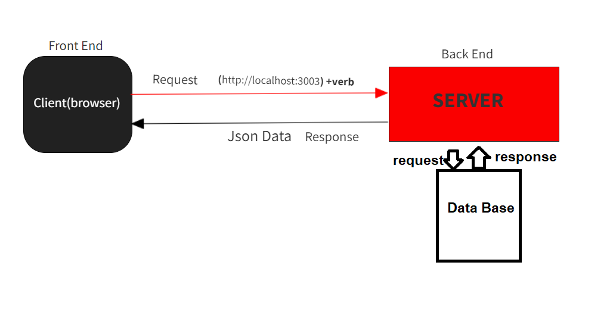

# Movies-Library
**Author Name**: Ahmad Khaled Mahmoud Zaid

## WRRC

## Overview
get information about  movies.
## Getting Started

1- first download node js.
2- download express package
3- import express package to the server.js or(what ever the file name)
4- create application from express
5- create routes and add the needed information
6- download PostgresQL package and connect the server to the database
7- add the new endpoints

## Project Features
users can get data about movies from this website and can route to different endPoints, when entering wrong route or some error happen from the server side a message will be shown to the user,
users right now can get some info about movies,latest, trending, images and more
updated:
now users can add send their favorite movies to the server these movies will be saved permanently on the databases, also user able now to retrieve all the movies stores in the data base.