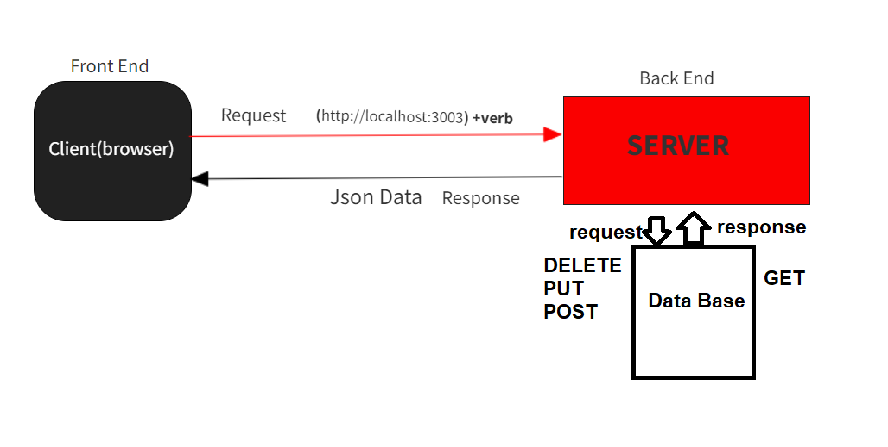

# Movies-Library
**Author Name**: Ahmad Khaled Mahmoud Zaid

## WRRC

## Overview
get information about  movies.
## Getting Started

1- first download node js.
2- download express package
3- import express package to the server.js or(what ever the file name)
4- create application from express
5- create routes and add the needed information 

## Project Features
users can get data about movies from this website and can route to different endPoints, when entering wrong route or some error happen from the server side a message will be shown to the user
